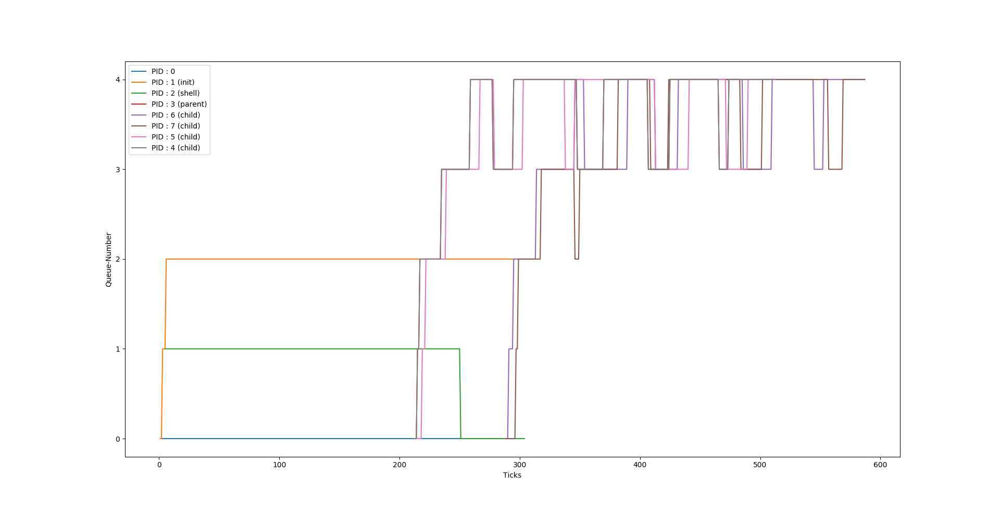

# Scheduling Algorithms implemented in MIT-xv6
In this I have implemented some of the scheduling algorithms in MIT-xv6 operating system.Default scheduling algorithm is Round-Robbin in this operating system.

# FCFS
This is based on first come first serve policy.This is a non-preemptive policy.Processes get
opportunity to run based on their time of arrivals.

# PBS
This is a preemptive policy. In this process with higher priority runs first as compared to those with higher priority. Always a process with higher priority will run first. In case a process with lower priority is running and now a new process with higher priority comes then the one with lower priority will get preempted and higher one will run first. Also we have option to change priority of a process with function `set_priority` implemented which take priority value and pid.

# MLFQ
MLFQ scheduler allows processes to move between different priority queues based
on their behavior and CPU bursts. If a process uses too much CPU time, it is pushed
to a lower priority queue, leaving I/O bound and interactive processes for higher
priority queues. Also, to prevent starvation aging is implemented. In this total of 5 queue's are implemented.
The time-slice for priority 0 is 1 timer tick. The times-slice for priority 1
is 2 timer ticks; for priority 2, it is 4 timer ticks; for priority 3, it is 8 timer ticks;
for priority 4, it is 16 timer ticks.

Files include two tester files:
1. tester1.c : This file is a tester file to compare time taken by various algorithms.To run this use `time tester1` and process will run with mentioned scheduling algorithm and at last print the total runtime and waittime taken by the tester1 programme.Through this you can compare the performance of various algorithms.
2. tester2.c : This file is to show properly how various algorithms are running. This is accomplished by printing various fields like present queue number in MLFQ etc. Run this file with various scheduling algorithms and it will properly show functioning of various algorithms.eg.In PBS algorithm I have assignmed a priority value of PID/2 to every process with which we can see that while running tester2 file process with low value of pid (i.e low value of priority as priority = pid/2) will run first and also it will show Round Robbing as there will always be two process with same priority as priority = pid/2 eg . process with pid value 2 and 3 will have same priority 1. These type of process with same priority will follow round robbin policy.Run this file simply by `tester2`.

# Usage
```
make clean
make qemu SCHEDULER = <FLAG>
```
FLAG can be PBS(Priority Based Scheduling),FCFS(First come first server Scheduling),MLFQ(Multilevel Feedback Queue Scheduling)
Default value is Round Robbin Scheduling

Also it includes graphs to show results of MLFQ scheduling policy with various types of process and one to show running of MLFQ with same type of process.



